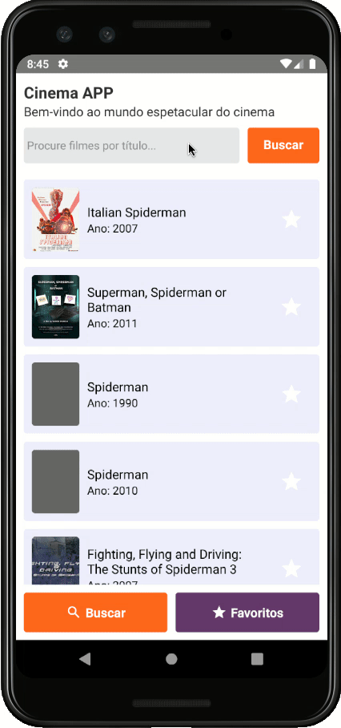

<p align="center">
  
</p>

# dev-cinemapp

# Descrição Geral

## Interface Front-End

Como o aplicativo deveria rodar de forma fluida obrigatoriamente em dispositivos móveis, optei pelo React Native para construir uma aplicação mobile.

Devido ao uso de ícones personalizados (react-native-vector-icons), e por ter sido construído utilizando um PC com linux e emulador Android, este aplicativo precisará de alguns ajustes para rodar em um dispositivo com iOS.

## Principais bibliotecas utilizadas

- react-redux: compartilhamento de conteúdo entre componentes
- redux-persist + @react-native-community/async-storage: para persistência dos dados através do Redux.
- axios: cliente HTTP utilizado para a requisição GET com a api do site http://www.omdbapi.com/
- react-navigation: roteamento e navegação entre telas
- styled-components: sintaxe CSS para componentes React

## Descrição das telas

### Search

Tela aberta inicialmente quando o aplicativo é carregado. A lista de filmes deve conter o poster do filme, o título e o ano de lançamento.

A partir dela o usuário deve poder:

- Pesquisar filmes por título.
- Rolar a tela com "scroll infinito" (paginação automática)
- Marcar um filme como favorito.
- Desmarcar um filme como favorito.
- Navegar até a tela de favoritos tocando no botão Favoritos.

### Favoritos

Esta tela exibe a lista de filmes marcados como favorito.
A lista de filmes favoritos deve conter o poster do filme, o título e o ano de lançamento.

A partir dela o usuário deve poder:

- Retirar um filme da lista de favoritos.
- Navegar para a tela de pesquisa.

## Persistência de dados

Para armazenamento de dados foi adotada uma combinação de Redux + AsyncStorage, com o processo de persistência ocorrendo integrado, de forma transparente.

O Redux ofereceu a possibilidade de compartilhar de uma forma mais simples a lista dos filmes favoritos entre as telas.

## Modelo Hooks

O modelo Hooks foi escolhido ao invés do tradicional modelo de classes devido principalmente à agilidade de desenvolvimento e diminuição da verbosidade do código.

## TODO

Algumas possíveis melhorias que foram identificadas nas primeiras experimentações do aplicativo:

- Adicionar splash-screen na abertura do app.
- Adicionar categoria de favoritos para escolher quando favorita um filme.
- Adicionar filtro de ano na pesquisa.

## Para executar o código

Clone o repositório

```bash
$ git clone https://github.com/ivanseibel/dev-cinemapp
```

Acesse a pasta do repositório

```bash
$ cd dev-cinemapp
```

Atualizar os pacotes

```bash
$ yarn
```

Rodar o servidor para fazer o live reload

```bash
$ yarn start

# ou npx react-native start
```

Compilar e enviar a aplicação para o dispositivo móvel android

```bash
$ yarn android

# ou npx react-native run-android
```

Compilar e enviar a aplicação para o dispositivo móvel iOS

```bash
$ yarn ios

# ou npx react-native run-ios
# não foi testado com ios
```
